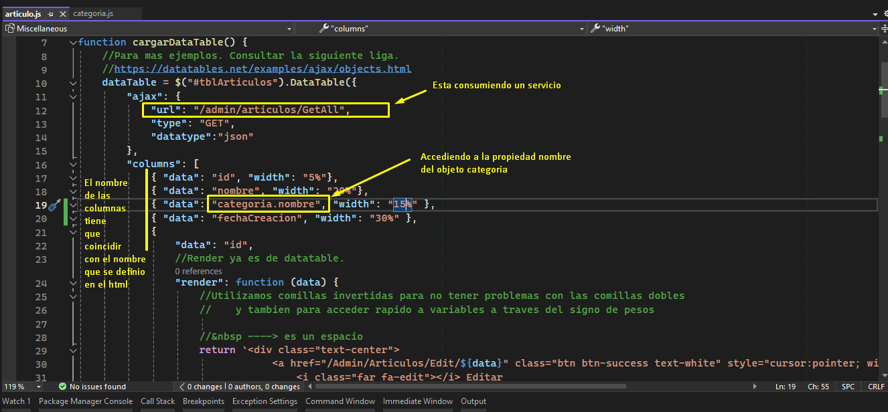
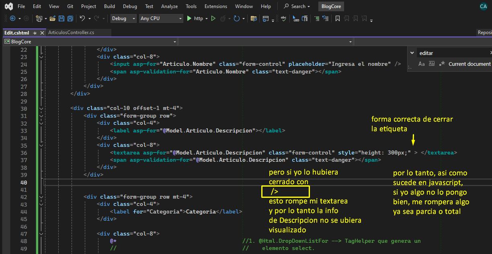

#### Borramos cache con Ctrl + F5

#### Snippets C#

prop -> Agregar una propiedad de instancia

ctor -> Agregar el constructor

#### Temas Generales

Nombre de Controladores va en Plural

Nombre de Tablas o Modelo va en Singular

Nombre de Repositorio va en Singular

Nombre controlador de javascript va en Singular

#### **Uso de Include**

#### Poner bien las etiquetas de HTML, de lo contrario me podria romper lo que intento poner

#### Para actualizar una entity, no es necesario consultarlo de la DB para traer el objeto, tambien se puede hacer si front nos envia el objeto ya armado, lo importante es que tenga valor en el Id o llave primaria y los demas campos se supone que son los modificados, y ya despues se pasa al metodo update y lo puedo actualizar

#### En los metodos de tipo [Delete], si yo le pongo el [ValidateAntiForgeryToken], al momento de consumirlo, no me lo va a reconocer

<pre class="vditor-reset" placeholder="" contenteditable="true" spellcheck="false">

</pre>

#### Si en el HTML agrego una columna en la tabla, tambien tengo que agregarlo en el Javascript donde se consume el servicio para renderizarlo, de lo contrario, nos mandara un error

