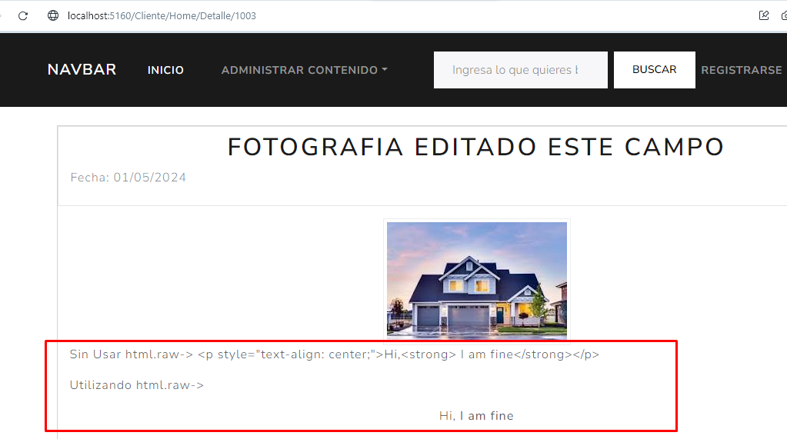
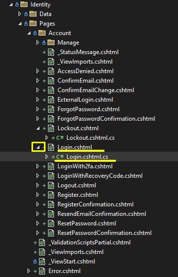

#### Borramos cache con Ctrl + F5

#### Snippets C#

prop -> Agregar una propiedad de instancia

ctor -> Agregar el constructor

#### Temas Generales

* Nombre de Controladores va en Plural
* Nombre de Tablas o Modelo va en Singular
* Nombre de Repositorio va en Singular
* Nombre controlador de javascript va en Singular
* Nombre de carpetas de las imagenes, va separado por controlador y en plural

  * 
* Nombre de vistas parciales "_NombreVistaParcial" en singular empezando con Mayuscula

### TagHelpers(Conocido en todo el curso)

* `@Html.DropDownListFor(m => m.Articulo.CategoriaId, Model.ListaCategorias, "-Por favor seleccion una categoria-", new { @class = "form-control" })`
* ``<th>@Html.DisplayNameFor(m => m.Id)</th>``
* `<td>@Html.DisplayFor(m => item.Id)</td> `
* `<p class="text-secondary">@Html.Raw(Model.Descripcion)</p>`
* `@Url.Content(slider.UrlImagen)`
* `<h1>@Html.Raw(slider.Nombre)</h1>`
* `@model BlogCore.Models.ViewModels.ArticuloVM`
* `@{ ViewData["Title"] = "Crear Articulo"; }`
* `@* Coments *@`
* `@section Scripts { }`
* `@using BlogCore`
* `@addTagHelper *, Microsoft.AspNetCore.Mvc.TagHelpers`
* `<h1>@ViewData["Title"]</h1>`
* `@page`
* `@RenderBody()`
* `@media (min-width: 768px) { html { font-size: 16px; } }`

### Asp- (Conocidos en todo el curso)

* `<form method="POST" asp-action="Create" enctype="multipart/form-data">`
* `<div asp-validation-summary="All" class="text-danger"></div>`
* `<label asp-for="Articulo.Nombre"></label>`
* `<input asp-for="Input.Password" class="form-control" autocomplete="current-password" aria-required="true" placeholder="password" />`
* `<span asp-validation-for="Articulo.Nombre" class="text-danger"></span>`
* `<a asp-page="./Disable2fa" class="btn btn-primary">Disable 2FA</a>`
* `<a asp-area="Identity" asp-page="/Account/Register" class="btn btn-info"> <i class="fas fa-plus"></i> &nbsp; Registra un nuevo usuario </a>s`
  * Para acceder a paginas Razor sin MVC
* `<a class="dropdown-item" asp-area="Admin" asp-controller="Categorias" asp-action="Index">Categorias</a>`
  * Para acceder a paginas de MVC
* `<a asp-action="Bloquear" asp-route-id="@item.Id"> <i class="fas fa-lock-open"></i> </a>`
* `<form asp-page-handler="Confirmation" asp-route-returnUrl="@Model.ReturnUrl" method="post">`
* `<a asp-page="./Register" asp-route-returnUrl="@Model.ReturnUrl">No tienes cuenta? Registrate Aquí</a>`
* `<input class="form-control me-sm-2 d-flex text-dark" asp-controller="Home" asp-action="resultadoBusqueda" method="get" placeholder="Ingresa lo que quieres buscar">`
* `<a class="dropdown-item" asp-area="Admin" asp-controller="Categorias" asp-action="Index">Categorias</a>`
* `<a class="page-link" asp-controller="Home" asp-action="Index" asp-route-page="@(Model.PageIndex - 1)">Anterior</a>`


#### **Uso de Include**


#### Poner bien las etiquetas de HTML, de lo contrario me podria romper lo que intento poner


#### Para actualizar una entity, no es necesario consultarlo de la DB para traer el objeto, tambien se puede hacer si front nos envia el objeto ya armado, lo importante es que tenga valor en el Id o llave primaria y los demas campos se supone que son los modificados, y ya despues se pasa al metodo update y lo puedo actualizar


#### En los metodos de tipo [Delete], si yo le pongo el [ValidateAntiForgeryToken], al momento de consumirlo, no me lo va a reconocer

<pre class="vditor-reset" placeholder="" contenteditable="true" spellcheck="false"><p data-block="0"></p></pre>

#### Si en el HTML agrego una columna en la tabla, tambien tengo que agregarlo en el Javascript donde se consume el servicio para renderizarlo, de lo contrario, nos mandara un error


#### ViewBag. Normalmente se utiliza para comportamientos del HTML, asi como para si estoy o no en una pagina de inicio, o para mandar variables y que interacturen con otras vistas


#### Html.Raw

Es para asegurar que se renderize el codigo HTML o para que se ejecute correctamente el Script.

El método `@Html.Raw()` en ASP.NET MVC es útil cuando necesitas renderizar HTML o scripts en tu vista de forma que no sean codificados HTML por defecto. Por default, Razor codifica los contenidos para evitar problemas de seguridad como inyecciones XSS (Cross-Site Scripting). Sin embargo, hay situaciones donde puedes necesitar insertar HTML o scripts que ya están formateados y quieres que se rendericen tal cual en el navegador.




### Diferencia entre Razor y MVC

* En MVC se tienen los controladores, metodos(Action) y Vistas
  * 
* Razor es un archivo cshtml con su archivo ligado directamente
  * 

### Autocomplete

```html
<input type="text" id="direccion" name="direccion" autocomplete="direccion" />`
```

* 

### Request.Form["radUsuarioRole"]

* 

### Solo inyectar el IUnitOfWork en el IoT(contenedor de depencias)

Los repos instanciarlos dentro del constructor del UnitOfWork, y asi nos evitamos inyectarlos en el IoT, ya que ese proceso es mas tedioso


### Liga para ir a una pagina de MVC (asp-area, asp-controller y asp-action)


### Liga para ir a una pagina Razor que no tiene MVC (asp-area y asp-page)


### Claims


### Autorizacion a parte de HTML


### Proteger controladores

Si se pone a nivel Controlador, aplica para todos los Action del controlador

Si se pone a nivel de Action, sobreescribe lo que tenga a nivel de Controlador

* Nivel de Controlador o de Action
  * [Authorize]
    * Cualquiera que este autenticado
  * [Authorize("Administrador")]
    * Solo el Rol Administrador
  * [AllowAnonymous]
    * Define un action como publico, cualquiera puede tener acceso


### Recibir valores en parametros del Action desde un Input


### Recibir valores en parametros del Action desde cualquier elemento(Boton, enlace, etc)


### Clase interesante para Paginacion

Es interesante porque es como si se comportara como una lista de elementos, pero a su ves como si se comportara como una clase.


### Segunda Forma de Realizar Paginacion


