# UDY-MasterAspNetMvc-02BlogCore

## Seccion 2: Proyecto 1: Crud con Entity Framework Core

### Video 31 Creacion del proyecto

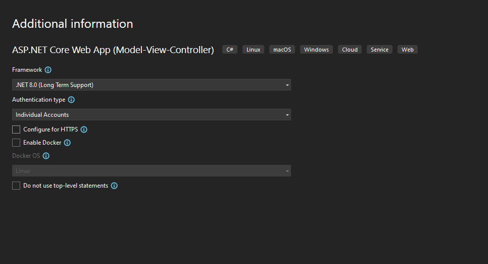

Ahora aparece una nuevas carpetas llamadas Areas y Data


Esto practicamente ya me configura todo, el appSettings

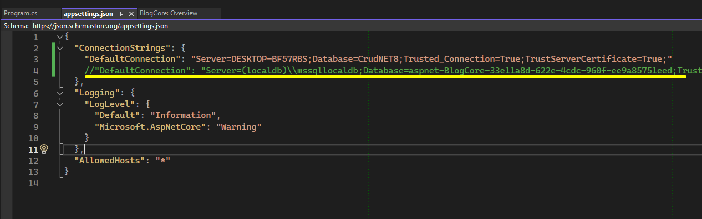

El Program tambien me lo configura


Tambien ya me configura las Dependencias

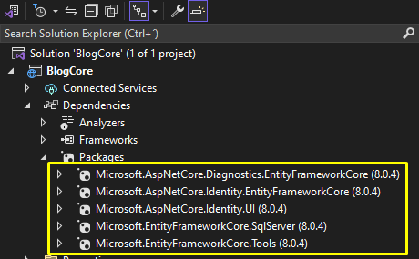

### Video 32 Creacion de las libreria de clases

Vamos a utilizar la arquitectura por capas.

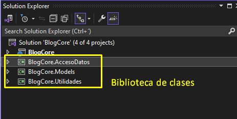

### Video 33 Instalacion de Extensiones necesarias

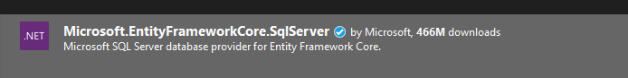

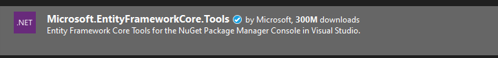

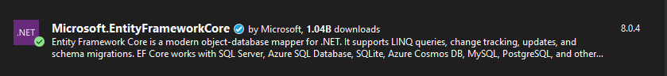

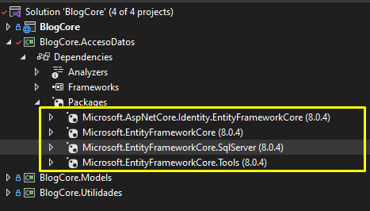

### Video 34 Organizacion del Proyecto en Areas

* **Creo dos areas de MVC llamados Admin y Cliente**


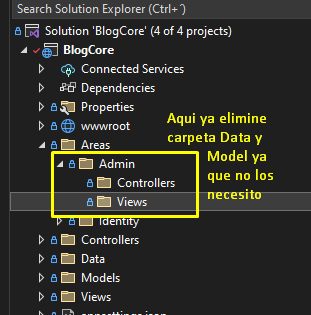

**Hacemos cambios escructurales**

* Muevo mi HomeController y mi vista al area cliente
* Complemento en los ViewImports
* Modifico el Programa para que apunte al controlador correcto
* En el ControladorHome indico a que area pertenece

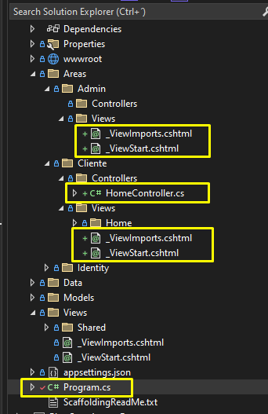

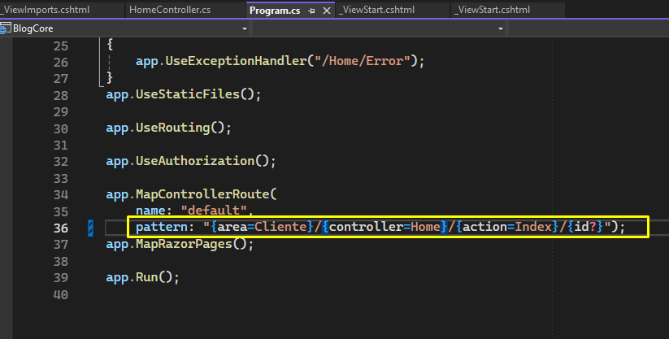


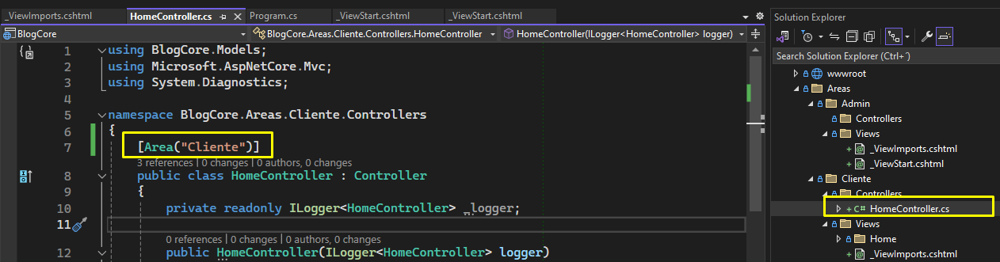

### Video 35 Organizacion del Proyecto por niveles

* **Movemos el modelo a su correspondiente capa**
* **La carpeta Data la movemos a su correspondiente capa**
* **La carpeta Migration lo dejo al mismo nivel jerarquico que Data**
* Agrego una referencia al Proyecto de BlogCore para que tenga acceso a la capa "AccesoDatos"
* Agrego una referencia al Proyecto de Acceso a datos para que tenga dependencia con

  * Models
  * Utilidades
* Creamos la carpeta ViewModes en el proyecto de Models

  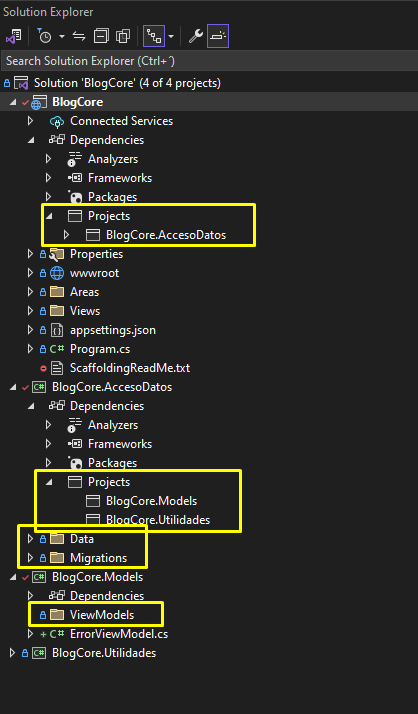

### Video 36 Configuracion de Bootstrap y Bootswatch

Bootswatch es como la siguiente Fase de Bootstrap, ya que te ofrece todo lo de bootstrap y ademas te

ofrece templates con sus respectivos colores y efectos(Atomos, Moleculas, Organismos)

* Descargo la version minimizada
* Creo un archivo de CSS dentro del directorio "wwwroot/lib/Bootstrap/dis/css/bootstrap5.min.css"
  * Dentro pego el contenido de lo que descargamos
* Vamos a la pagina maestra "_layout.cshtml"
  * **Remuevo** la etiqueta link de "~/lib/bootstrap/dist/css/**bootstrap.min.css**"
  * **Agrego** la etiqueta para el nuevo link de "~/lib/bootstrap/dist/css/**bootstrap5.min.css**"

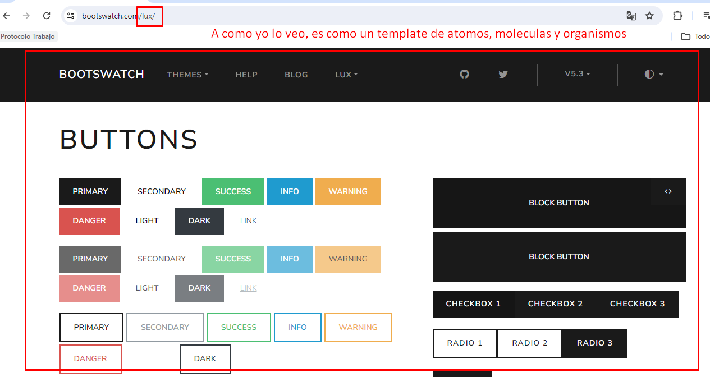

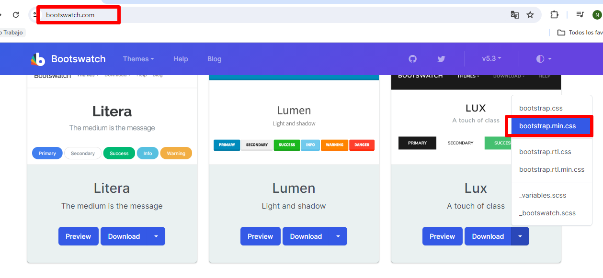

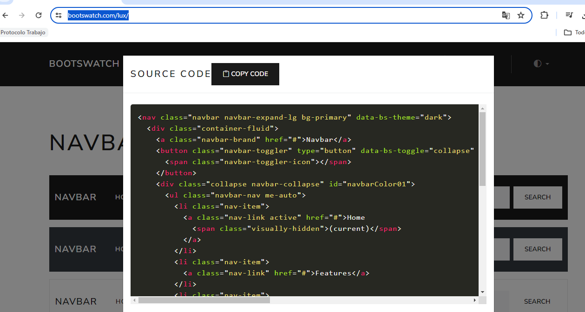

**Recomendacion de nombre de controladores, EN PLURAL**

* Elimino el nav que estaba en la pagina maestra
* Agrego el nuevo Nav

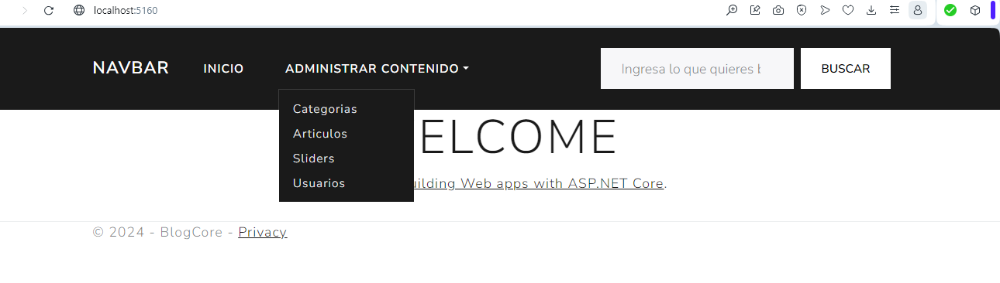

### Video 37 Instalacion de Plugins Frontend

* En la seccion anterior podemos crear tablas basicas, pero si queremos crear tablas mas avanzadas podemos utiliza el Plugin llamado **"DataTables"**
* **sDataTables [CSS, JS]**
* **JQuery [CSS, JS]**
* **Toastr [CSS, JS]** muestra ventanitas
* **sweetalert2[CSS, JS]** para mandar alertas
* **fontawesome.com/icons[CSS]**
* **cdnjs para encontrar las librerias**

  Los CSS se importan al inicio de la pantalla

  Los JS se importan al final de la pagina.

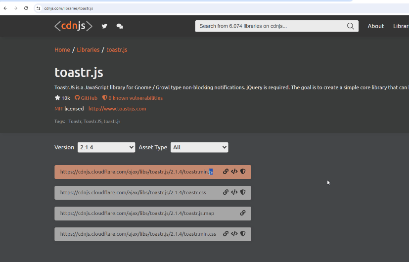

### Video 38 Conexion SQL, Contexto, Migraciones y Base de Datos

Renderizo una vista parcial con la etiqueta en el _Layout.

``<partial name="_LoginPartial" />``

Configuramos nuestra cadena de conexion

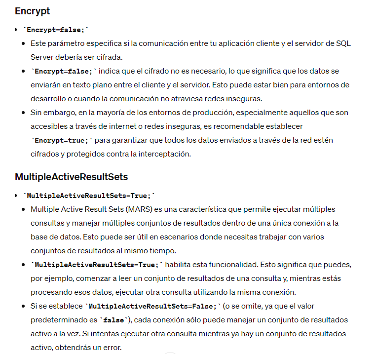

Ejecutamos el comando en el Command Nugget

``Update-Database``

### Video 39 Creacion Modelo Categoria, Migracion y Base de Datos

Se crear el Modelo Categoria

## **Seccion 4: BlogCore - RepositoryPattern**

### Video 40 Fundamentos de RepositoryPattern

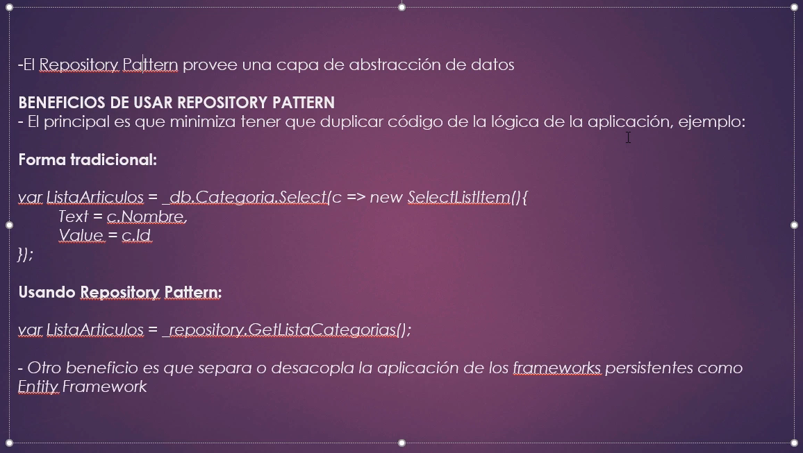

### Video 41 Introduccion RepositoryPattern

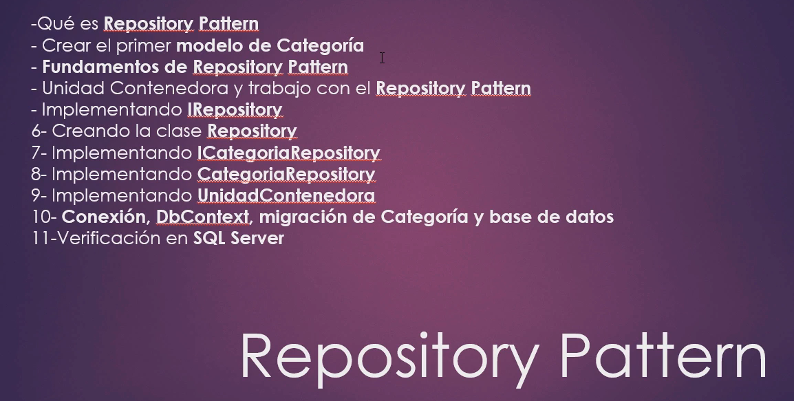

### Video 42 Unidad contenedora o unidad de trabajo

https://learn.microsoft.com/es-es/aspnet/mvc/overview/older-versions/getting-started-with-ef-5-using-mvc-4/implementing-the-repository-and-unit-of-work-patterns-in-an-asp-net-mvc-application

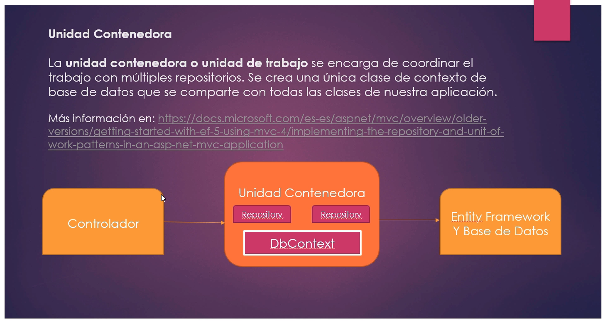

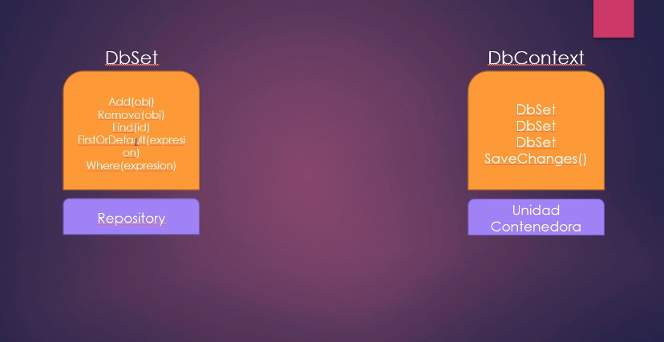

### Video 43 Como es el Flujo de Trabajo con el RepositoryPattern

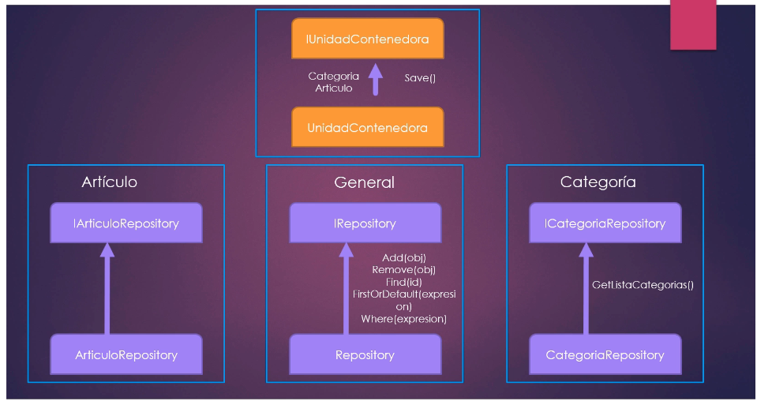

### Video 44 Implementando Repository Parte 1

* Agregamos la carpeta Repository dentro de la capa AccesoDatos/Data
  * Creamos la carpeta IRepository
    * Creamos el interfaz IRepository Generico con su contenido
  * Creamos la clase Repository Generico con su contenido

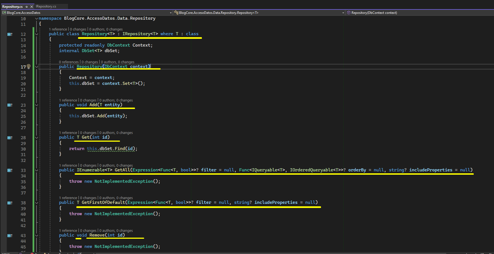

### Video 45 Implementando Repository Parte 2

```}}
public IEnumerable<T> GetAll(Expression<Func<T, bool>>? filter = null, Func<IQueryable<T>, IOrderedQueryable<T>>? orderBy = null, string? includeProperties = null)
{
    //                                              //Se crea una consulta IQueryable a partir del DBSet del 
    //                                              //    contexto.
    IQueryable<T> query = dbSet;

    if (
        //                                          //Existe el filtro.
        filter != null
        )
    {
        query = query.Where(filter);
    }

    //                                              //Se incluyen propiedades de navegacion si se proporciona.
    if (
        includeProperties != null
        )
    {
        //                                          //Take each includeProperty
        foreach (var includeProperty in 
            includeProperties.Split(new char[] {','}, StringSplitOptions.RemoveEmptyEntries))
        {
            query = query.Include(includeProperty);
        }
    }

    //                                              //Se aplica el ordenamiento si se proporciona.
    if (
        orderBy != null
        )
    {
        //                                          //Se ejecuta la funcion y se convierte la consulta
        //                                          //    en una lista.
        return orderBy(query).ToList();
    }

    return query.ToList();
}

public T GetFirstOfDefault(Expression<Func<T, bool>>? filter = null, string? includeProperties = null)
{
    //                                              //Se crea una consulta IQueryable a partir del DBSet del 
    //                                              //    contexto.
    IQueryable<T> query = dbSet;

    if (
        //                                          //Existe el filtro.
        filter != null
        )
    {
        query = query.Where(filter);
    }

    //                                              //Se incluyen propiedades de navegacion si se proporciona.
    if (
        includeProperties != null
        )
    {
        //                                          //Take each includeProperty
        foreach (var includeProperty in
            includeProperties.Split(new char[] { ',' }, StringSplitOptions.RemoveEmptyEntries))
        {
            query = query.Include(includeProperty);
        }
    }

    return query.FirstOrDefault();
}

public void Remove(int id)
{
    T entityToRemove = dbSet.Find(id);
}

public void Remove(T entity)
{
    dbSet.Remove(entity);
}

```

### Video 46 Repositorio Categoria

* Se agrego la Interfaz ICategoria
* Se agrego la clase Categoria

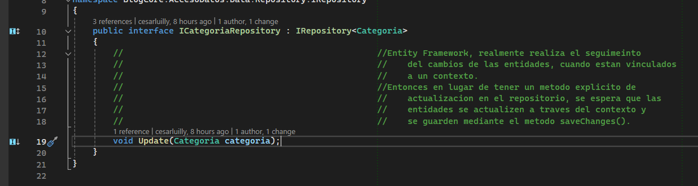

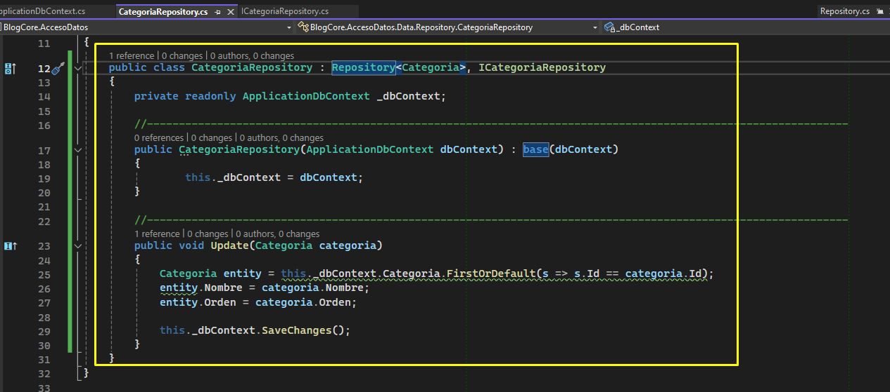

### Video 47.0 Ejercicio de codificacion 2: Implementacion Patron de Repositorio (RepositoryPattern)

### Video 47.1 Implementando Unidad de Trabajo (Unit Of Work)

Es un patron que se utiliza para gestionar transaciones en un conjunto de operaciones, asegura 

que todas las unidades de trabajo, se ejecuten en una transacion.

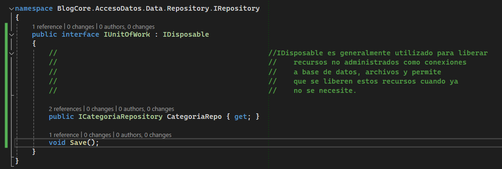

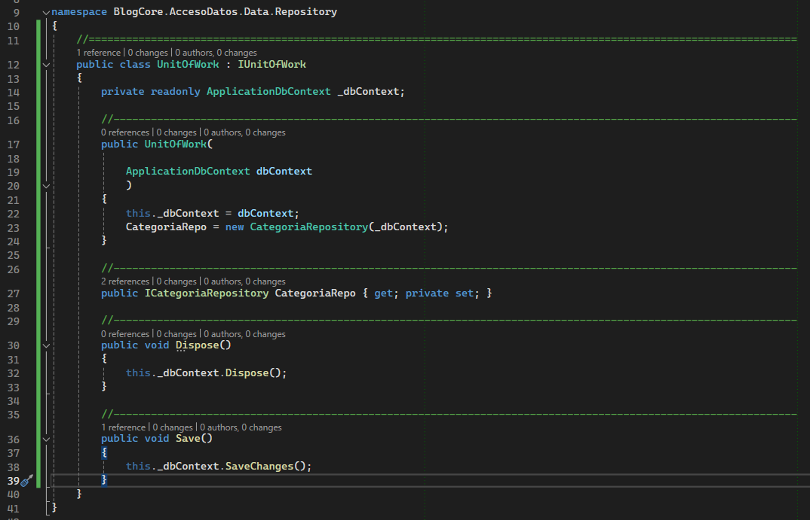

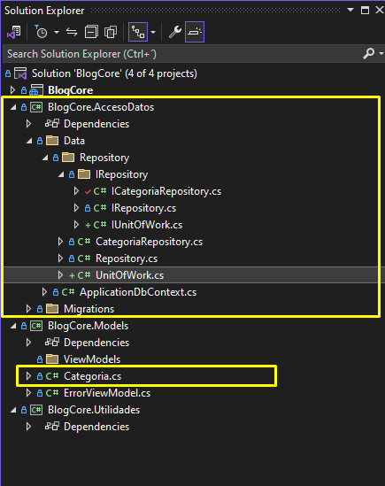

### Video 48 Crear Controlador Categorias

Nota. El nombre de los controladores lleva el nombre 

* Agregamos controlador MVC en blanco en el area de Admin
  * Lo primero que debemos hacer despues de crear un controlador, es ponerle el area al cual pertenece [Area("Admin")]
  * Agregamos su contenido

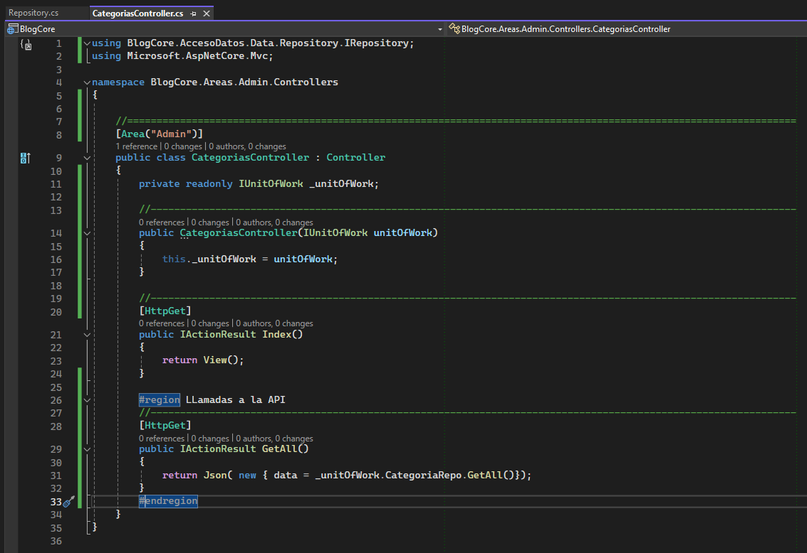

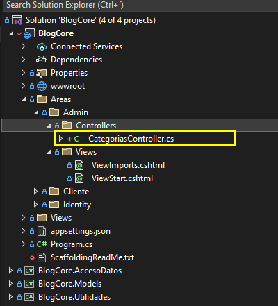

* Agregamos la vista razor vacia del controlador del metodo Index.

  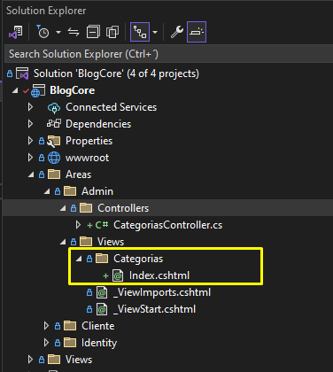


### Video 49 Crear Vista Lista de Categorias

Liga para la implementacion de DataTable -> https://datatables.net/examples/data_sources/js_array

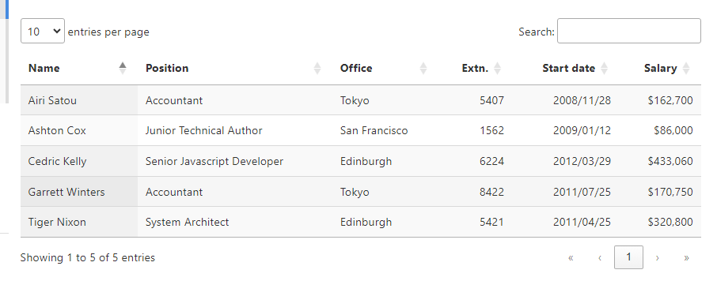

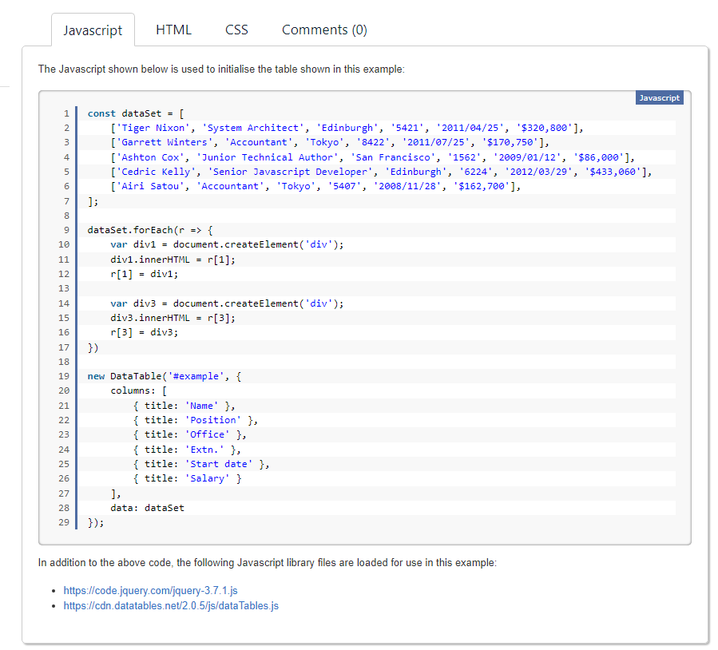

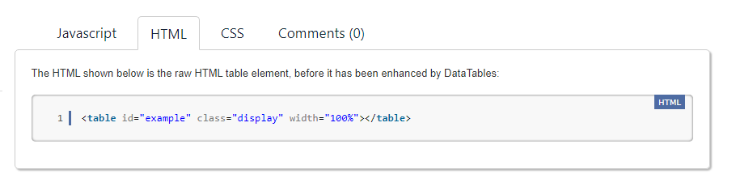

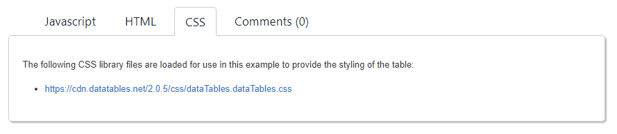

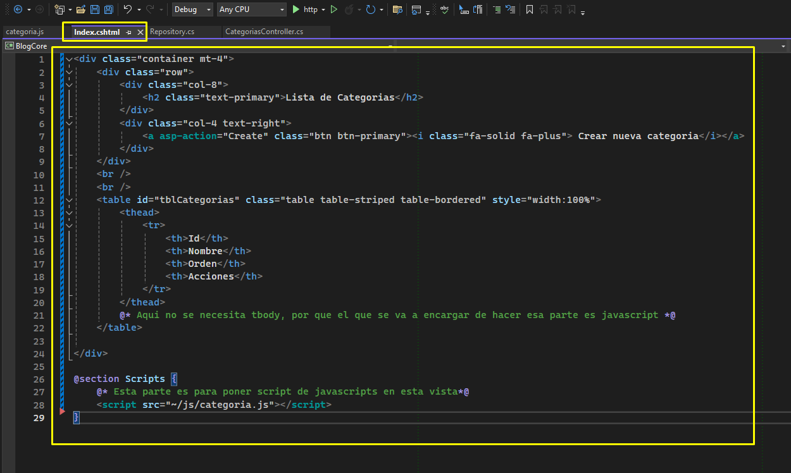

Documento Categoria.js

```javascript
let dataTable;

$(document).ready(function () {
    cargarDataTable();
});

function cargarDataTable() {
    //Para mas ejemplos. Consultar la siguiente liga.
    //https://datatables.net/examples/ajax/objects.html
    dataTable = $("#tblCategorias").DataTable({
        "ajax": {
            "url": "/admin/categorias/GetAll",
            "type": "GET",
            "datatype":"json"
        },
        "columns": [
            { "data": "id", "width": "5%"},
            { "data": "nombre", "width": "50%"},
            { "data": "orden", "width": "20%" },
            {
                "data": "id",   
                //Render ya es de datatable.
                "render": function (data) {
                    //Utilizamos comillas invertidas para no tener problemas con las comillas dobles
                    //    y tambien para acceder rapido a variables a traves del signo de pesos

                    //&nbsp ----> es un espacio
                    return `<div class="text-center">
                                <a href="/Admin/Categorias/Edit/${data}" class="btn btn-success text-white" style="cursor:pointer; width:140px;">
                                    <i class="far fa-edit"></i> Editar
                                </a>
                                 
                                <a onclick=Delete("/Admin/Categorias/Delete/${data}") class="btn btn-danger text-white" style="cursor:pointer; width:140px;">
                                    <i class="far fa-trash-alt"></i> Borrar
                                </a>
                            </div>
                            `;
                }, 
                "width": "40%"
            }
        ],
        "language": {
            "decimal": "",
            "emptyTable": "No hay registros",
            "info": "Mostrando _START_ a _END_ de _TOTAL_ Entradas",
            "infoEmpty": "Mostrando 0 to 0 of 0 Entradas",
            "infoFiltered": "(Filtrado de _MAX_ total entradas)",
            "infoPostFix": "",
            "thousands": ",",
            "lengthMenu": "Mostrar _MENU_ Entradas",
            "loadingRecords": "Cargando...",
            "processing": "Procesando...",
            "search": "Buscar:",
            "zeroRecords": "Sin resultados encontrados",
            "paginate": {
                "first": "Primero",
                "last": "Ultimo",
                "next": "Siguiente",
                "previous": "Anterior"
            }
        },
        "width": "100%"
    });
}

```

### Video 50 Agregar Contenedor de Trabajo como Inyeccion de Dependencias

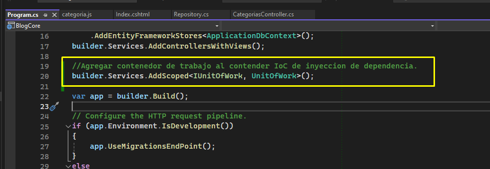

Ahora si ya podemos correr nuestra aplicacion

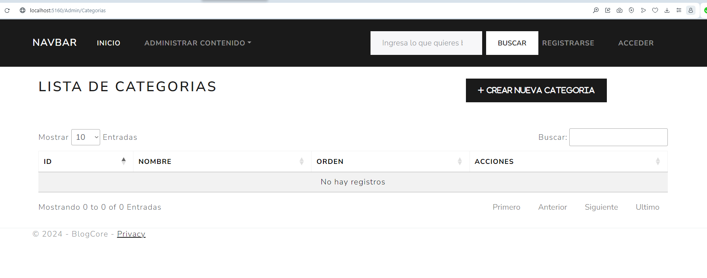


### Video 51 Metodo y Vista Crear Categoria

* Agregamos el Action Create en el controlador Categoria
* Creamos la vista parcial "_VistaCrearVolver"

  * Esto se hace posicionandonos en carpeta "Shared" damos click derecho y escojemos agregar Vista vacio
  * Para renderizar la vista hacemos uso de la etiqueta partial `<partial name="_VistaCrearVolver" />`

  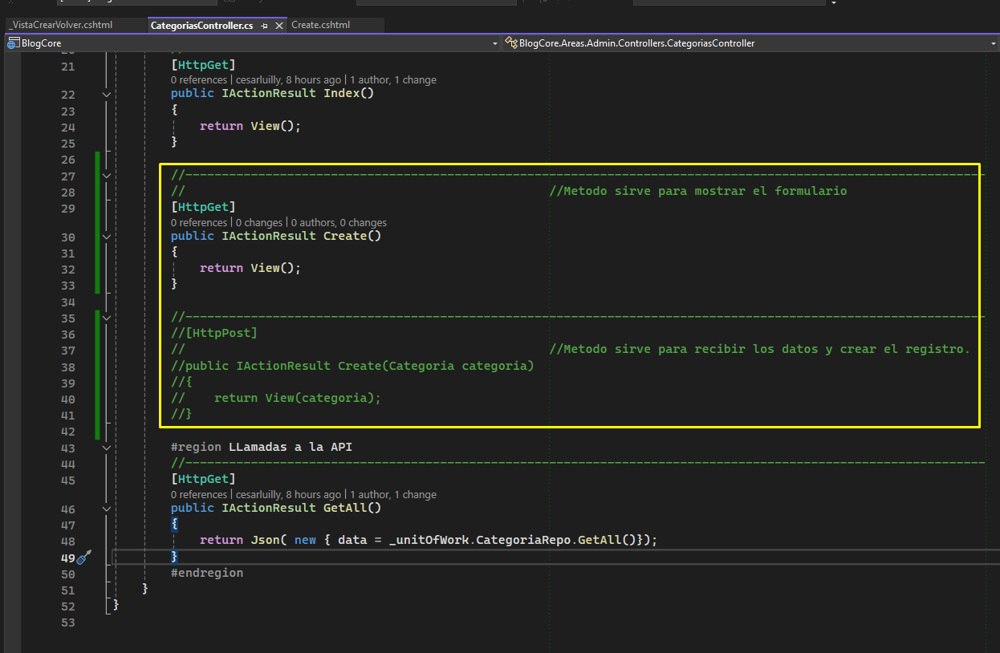

  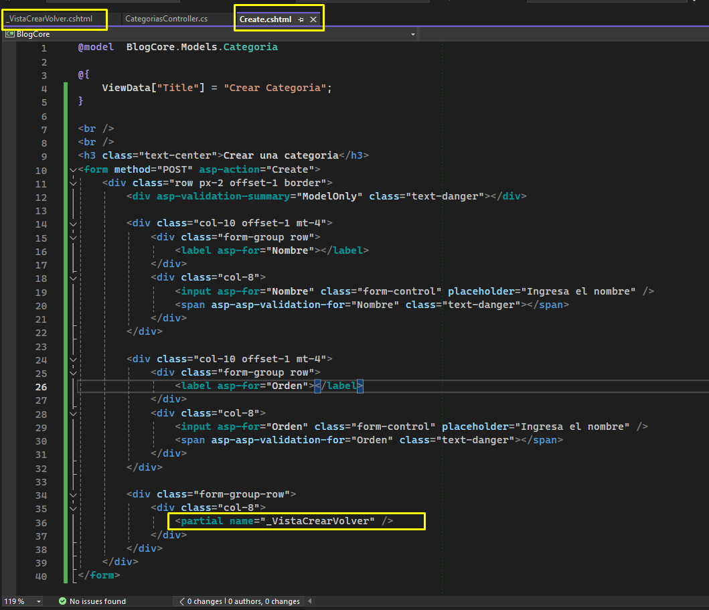

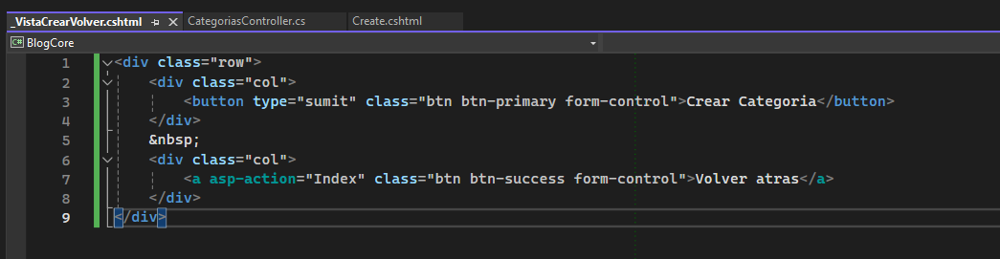


### Video 52 Funcionalidad Crear Nueva Categoria

* Crear el Action de Edit de tipo [GET] y su Vista(La vista es una copia del del Create)
* Creamos el Action de Edit de tipo [POST] para poder editar la categoria


### Video 53 Editar Categoria

### Video 54 Borrar Categoria

### Video 55 Validacion del Lado del Servidor

### Video 56 Validacion del Lado del Cliente

## Seccion 6: BlogCore: CRUD Articulos

### Video 57
