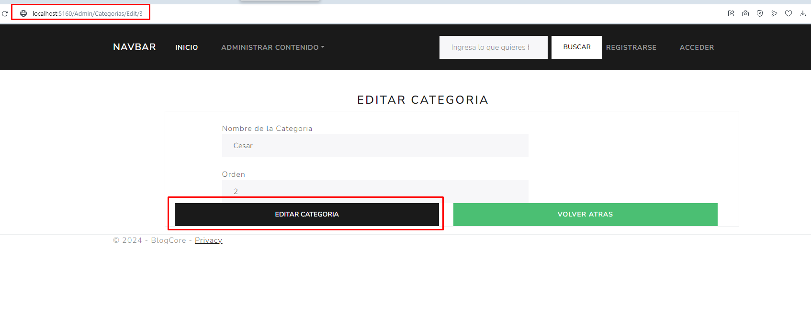
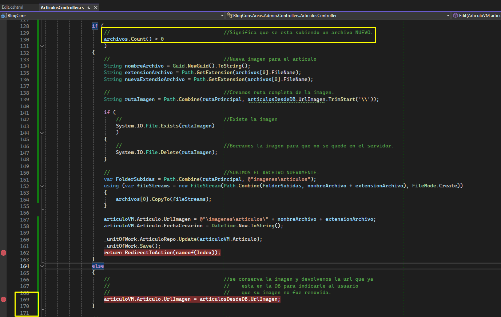
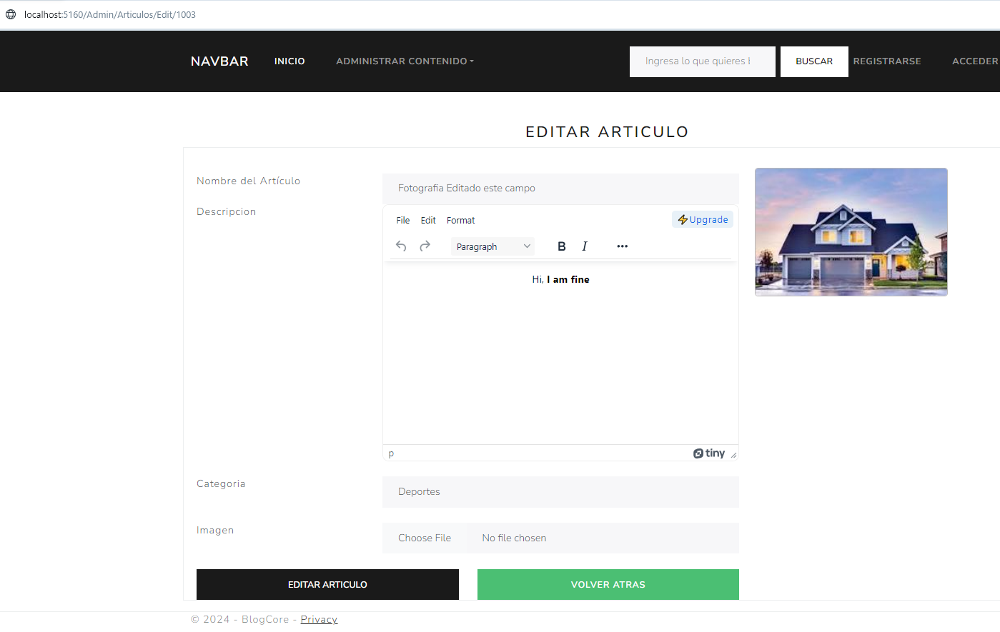
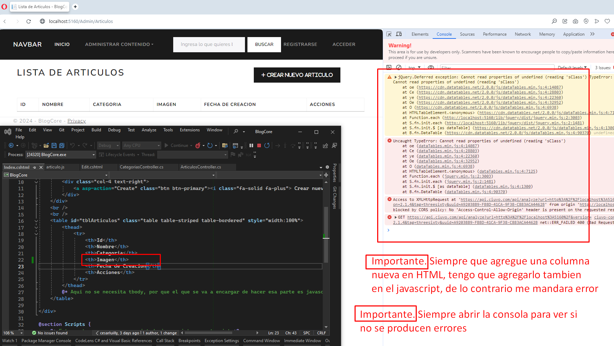
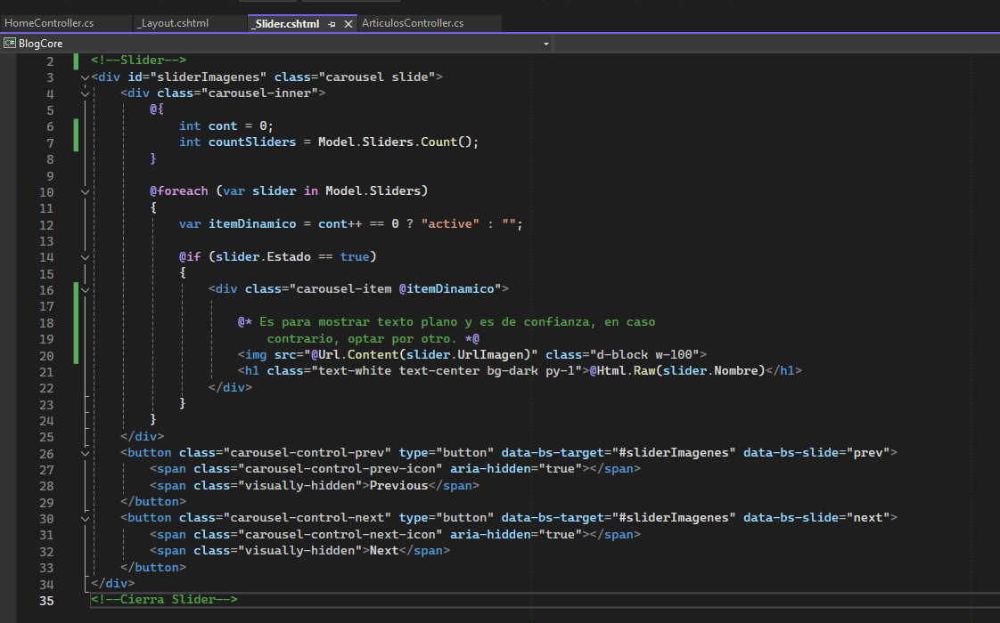

# UDY-MasterAspNetMvc-02BlogCore

## Seccion 2: Proyecto 1: Crud con Entity Framework Core

### Video 31 Creacion del proyecto


Ahora aparece una nuevas carpetas llamadas Areas y Data


Esto practicamente ya me configura todo, el appSettings


El Program tambien me lo configura


Tambien ya me configura las Dependencias


### Video 32 Creacion de las libreria de clases

Vamos a utilizar la arquitectura por capas.


### Video 33 Instalacion de Extensiones necesarias


### Video 34 Organizacion del Proyecto en Areas

* **Creo dos areas de MVC llamados Admin y Cliente**


**Hacemos cambios escructurales**

* Muevo mi HomeController y mi vista al area cliente
* Complemento en los ViewImports
* Modifico el Programa para que apunte al controlador correcto
* En el ControladorHome indico a que area pertenece


### Video 35 Organizacion del Proyecto por niveles

* **Movemos el modelo a su correspondiente capa**
* **La carpeta Data la movemos a su correspondiente capa**
* **La carpeta Migration lo dejo al mismo nivel jerarquico que Data**
* Agrego una referencia al Proyecto de BlogCore para que tenga acceso a la capa "AccesoDatos"
* Agrego una referencia al Proyecto de Acceso a datos para que tenga dependencia con

  * Models
  * Utilidades
* Creamos la carpeta ViewModes en el proyecto de Models

  

### Video 36 Configuracion de Bootstrap y Bootswatch

Bootswatch es como la siguiente Fase de Bootstrap, ya que te ofrece todo lo de bootstrap y ademas te

ofrece templates con sus respectivos colores y efectos(Atomos, Moleculas, Organismos)

* Descargo la version minimizada
* Creo un archivo de CSS dentro del directorio "wwwroot/lib/Bootstrap/dis/css/bootstrap5.min.css"
  * Dentro pego el contenido de lo que descargamos
* Vamos a la pagina maestra "_layout.cshtml"
  * **Remuevo** la etiqueta link de "~/lib/bootstrap/dist/css/**bootstrap.min.css**"
  * **Agrego** la etiqueta para el nuevo link de "~/lib/bootstrap/dist/css/**bootstrap5.min.css**"


**Recomendacion de nombre de controladores, EN PLURAL**

* Elimino el nav que estaba en la pagina maestra
* Agrego el nuevo Nav


### Video 37 Instalacion de Plugins Frontend

* En la seccion anterior podemos crear tablas basicas, pero si queremos crear tablas mas avanzadas podemos utiliza el Plugin llamado **"DataTables"**
* **sDataTables [CSS, JS]**
* **JQuery [CSS, JS]**
* **Toastr [CSS, JS]** muestra ventanitas
* **sweetalert2[CSS, JS]** para mandar alertas
* **fontawesome.com/icons[CSS]**
* **cdnjs para encontrar las librerias**

  Los CSS se importan al inicio de la pantalla

  Los JS se importan al final de la pagina.


### Video 38 Conexion SQL, Contexto, Migraciones y Base de Datos

Renderizo una vista parcial con la etiqueta en el _Layout.

``<partial name="_LoginPartial" />``

Configuramos nuestra cadena de conexion


Ejecutamos el comando en el Command Nugget

``Update-Database``

### Video 39 Creacion Modelo Categoria, Migracion y Base de Datos

Se crear el Modelo Categoria

## **Seccion 4: BlogCore - RepositoryPattern**

### Video 40 Fundamentos de RepositoryPattern


### Video 41 Introduccion RepositoryPattern


### Video 42 Unidad contenedora o unidad de trabajo

https://learn.microsoft.com/es-es/aspnet/mvc/overview/older-versions/getting-started-with-ef-5-using-mvc-4/implementing-the-repository-and-unit-of-work-patterns-in-an-asp-net-mvc-application


### Video 43 Como es el Flujo de Trabajo con el RepositoryPattern


### Video 44 Implementando Repository Parte 1

* Agregamos la carpeta Repository dentro de la capa AccesoDatos/Data
  * Creamos la carpeta IRepository
    * Creamos el interfaz IRepository Generico con su contenido
  * Creamos la clase Repository Generico con su contenido


### Video 45 Implementando Repository Parte 2

```}}
public IEnumerable<T> GetAll(Expression<Func<T, bool>>? filter = null, Func<IQueryable<T>, IOrderedQueryable<T>>? orderBy = null, string? includeProperties = null)
{
    //                                              //Se crea una consulta IQueryable a partir del DBSet del 
    //                                              //    contexto.
    IQueryable<T> query = dbSet;

    if (
        //                                          //Existe el filtro.
        filter != null
        )
    {
        query = query.Where(filter);
    }

    //                                              //Se incluyen propiedades de navegacion si se proporciona.
    if (
        includeProperties != null
        )
    {
        //                                          //Take each includeProperty
        foreach (var includeProperty in 
            includeProperties.Split(new char[] {','}, StringSplitOptions.RemoveEmptyEntries))
        {
            query = query.Include(includeProperty);
        }
    }

    //                                              //Se aplica el ordenamiento si se proporciona.
    if (
        orderBy != null
        )
    {
        //                                          //Se ejecuta la funcion y se convierte la consulta
        //                                          //    en una lista.
        return orderBy(query).ToList();
    }

    return query.ToList();
}

public T GetFirstOfDefault(Expression<Func<T, bool>>? filter = null, string? includeProperties = null)
{
    //                                              //Se crea una consulta IQueryable a partir del DBSet del 
    //                                              //    contexto.
    IQueryable<T> query = dbSet;

    if (
        //                                          //Existe el filtro.
        filter != null
        )
    {
        query = query.Where(filter);
    }

    //                                              //Se incluyen propiedades de navegacion si se proporciona.
    if (
        includeProperties != null
        )
    {
        //                                          //Take each includeProperty
        foreach (var includeProperty in
            includeProperties.Split(new char[] { ',' }, StringSplitOptions.RemoveEmptyEntries))
        {
            query = query.Include(includeProperty);
        }
    }

    return query.FirstOrDefault();
}

public void Remove(int id)
{
    T entityToRemove = dbSet.Find(id);
}

public void Remove(T entity)
{
    dbSet.Remove(entity);
}

```

### Video 46 Repositorio Categoria

* Se agrego la Interfaz ICategoria
* Se agrego la clase Categoria


### Video 47.0 Ejercicio de codificacion 2: Implementacion Patron de Repositorio (RepositoryPattern)

### Video 47.1 Implementando Unidad de Trabajo (Unit Of Work)

Es un patron que se utiliza para gestionar transaciones en un conjunto de operaciones, asegura

que todas las unidades de trabajo, se ejecuten en una transacion.


### Video 48 Crear Controlador Categorias

Nota. El nombre de los controladores lleva el nombre

* Agregamos controlador MVC en blanco en el area de Admin
  * Lo primero que debemos hacer despues de crear un controlador, es ponerle el area al cual pertenece [Area("Admin")]
  * Agregamos su contenido


* Agregamos la vista razor vacia del controlador del metodo Index.

  

### Video 49 Crear Vista Lista de Categorias

Liga para la implementacion de DataTable -> https://datatables.net/examples/data_sources/js_array


Documento Categoria.js

```javascript
let dataTable;

$(document).ready(function () {
    cargarDataTable();
});

function cargarDataTable() {
    //Para mas ejemplos. Consultar la siguiente liga.
    //https://datatables.net/examples/ajax/objects.html
    dataTable = $("#tblCategorias").DataTable({
        "ajax": {
            "url": "/admin/categorias/GetAll",
            "type": "GET",
            "datatype":"json"
        },
        "columns": [
            { "data": "id", "width": "5%"},
            { "data": "nombre", "width": "50%"},
            { "data": "orden", "width": "20%" },
            {
                "data": "id",   
                //Render ya es de datatable.
                "render": function (data) {
                    //Utilizamos comillas invertidas para no tener problemas con las comillas dobles
                    //    y tambien para acceder rapido a variables a traves del signo de pesos

                    //&nbsp ----> es un espacio
                    return `<div class="text-center">
                                <a href="/Admin/Categorias/Edit/${data}" class="btn btn-success text-white" style="cursor:pointer; width:140px;">
                                    <i class="far fa-edit"></i> Editar
                                </a>
                                 
                                <a onclick=Delete("/Admin/Categorias/Delete/${data}") class="btn btn-danger text-white" style="cursor:pointer; width:140px;">
                                    <i class="far fa-trash-alt"></i> Borrar
                                </a>
                            </div>
                            `;
                }, 
                "width": "40%"
            }
        ],
        "language": {
            "decimal": "",
            "emptyTable": "No hay registros",
            "info": "Mostrando _START_ a _END_ de _TOTAL_ Entradas",
            "infoEmpty": "Mostrando 0 to 0 of 0 Entradas",
            "infoFiltered": "(Filtrado de _MAX_ total entradas)",
            "infoPostFix": "",
            "thousands": ",",
            "lengthMenu": "Mostrar _MENU_ Entradas",
            "loadingRecords": "Cargando...",
            "processing": "Procesando...",
            "search": "Buscar:",
            "zeroRecords": "Sin resultados encontrados",
            "paginate": {
                "first": "Primero",
                "last": "Ultimo",
                "next": "Siguiente",
                "previous": "Anterior"
            }
        },
        "width": "100%"
    });
}

```

### Video 50 Agregar Contenedor de Trabajo como Inyeccion de Dependencias


Ahora si ya podemos correr nuestra aplicacion


### Video 51 Metodo y Vista Crear Categoria

* Agregamos el Action Create en el controlador Categoria
* Creamos la vista parcial "_VistaCrearVolver"

  * Esto se hace posicionandonos en carpeta "Shared" damos click derecho y escojemos agregar Vista vacio
  * Para renderizar la vista hacemos uso de la etiqueta partial `<partial name="_VistaCrearVolver" />`

  

  


### Video 52 Funcionalidad Crear Nueva Categoria

* Crear el Action de Edit de tipo [GET] y su Vista(La vista es una copia del del Create)
* Creamos el Action de Edit de tipo [POST] para poder editar la categoria



### Video 53 Editar Categoria

### Video 54 Borrar Categoria

Agregamos Librerias Sweetalert y Toast js y css

```html
Al inicio
<link rel="stylesheet" href="https://cdnjs.cloudflare.com/ajax/libs/toastr.js/2.1.4/toastr.min.css" />
<link rel="stylesheet" href="https://cdnjs.cloudflare.com/ajax/libs/sweetalert/1.1.3/sweetalert.min.css" />

Al final
<script type="text/javascript" src="https://cdnjs.cloudflare.com/ajax/libs/toastr.js/2.1.4/toastr.min.js"></script>
<script type="text/javascript" src="https://cdnjs.cloudflare.com/ajax/libs/sweetalert/1.1.3/sweetalert.min.js"></script>
```

Creamos el Action de Delete


Agregamos la funcion de Javascript de Delete, que va a ser invocado en el metodo

```javascript
function Delete(url) {
    swal({
        title: "Esta seguro de borrar?",
        text: "Este contenido no se puede recuperar!",
        type: "warning",
        showCancelButton: true,
        confirmButtonColor: "#DD6B55",
        confirmButtonText: "Si, borrar!",
        closeOnconfirm: true
    }, function () {
        $.ajax({
            type: 'DELETE',
            url: url,
            success: function (data) {
                if (data.success) {
                    toastr.success(data.message);
                    dataTable.ajax.reload();
                }
                else {
                    toastr.error(data.message);
                }
            }
        });
    });
}
```

### Video 55 Validacion del Lado del Servidor

Esta validacion se logra

* ```c#
  `if (ModelState.IsValid)
  ```
* ```c#
  <div asp-validation-summary="All" class="text-danger"></div>` O <div asp-validation-summary="ModelOnly" class="text-danger"></div> 
  ```


### Video 56 Validacion del Lado del Cliente

Prestamos atencion al archivo que se creo cuando creamos el proyecto `_ValidationScriptsPartial`


Importamos el archivo en los lugares donde deseemos realizar una validacion, por lo general es

en los servicios de tipo POST.


Ahora corremos la aplicacion y tecleamos un valor en el Orden, y si nos fijamos sin haberle dado click en el

boton "Crear Categoria", la validacion se hace en automatico


## Seccion 6: BlogCore: CRUD Articulos

### Video 57 Crear Modelo Articulo, Migracion y Base de Datos

* Creamos Modelo Articulo
* Agregamos Articulo en el contexto

  

### Video 58 Repositorio Articulo y Unidad de trabajo

* Creamos el Repo de Articulo
* Agregamos el Repo de Articulo al UnitOfWork

### Video 59 Controlador y Lista de Articulos

* Agregamos controlador de Articulos y funcionalidad de listado(Es una copia del de categoria con sus modificaciones correspondientes)
* Agregamos Vista de Articulos y html para lista (Es una copia del de categoria con sus modificaciones correspondientes)
* Agregamos archivo Javascript de Articulo para consumir el servicio y mostrarlo en el datatable.
* Insertamos un Articulo insert into articulo values('Nom1', 'Desc', GETDATE(), 'TestRuta', 5);


### Video 60 Formulario para Crear Articulo

* Creamos el Action de Create(Nos basamos en el action de create de Categoria)
* Creamos su vista para el Create
* En el siguiente video se terminara de implementar un dropdown para elegir la categoria en el dropdown.

  

### Video 61 Lista de categorias al crear Articulo

Para trabajar con 2 tablas en una misma vista, tengo que crear un ViewModel, y lo que nos va a permitir es traer

datos de varias tablas.

Nombre se define por

* Nombre de la entidad principal con la que quiero trabajar
* Nombre identificador para ViewModel y puede ser
  * "ViewModel"
  * o Abreviado "VM"


Despues de esto, tenemos que hacer un cambio en `ArticulosController` en el metodo `Create`.

Para eso agregamos un metodo al Repositorio de Categoria


Agregamos el dropdown a traves del TagHelper @Html.DropDownListFor


Vamos a correr la aplicacion

* En caso de que mande error, hay que instalar la siguiente extension
  * 


### Video 62 Implementar Subida de Archivo - Parte 1

(NOTA. Se iso un acomodo bien de las etiquetas que habia anteriormente.)

Agregamos al Form el atributo -> enctype="multipart/form-data"


Agregamos la etiqueta.


Corremos la aplicacion


### Video 63 Implementar Subida de Archivo - Parte 2


Agrego la propiedad  `private readonly IWebHostEnvironment _hostingEnviroment;`

Creamos el Action Create con implementacion para subir archivos


* **Hemos echo una correcion en el commit del video 65 aqui en esta parte, y para no cambiar todas las imagenes, decidi solo poner la correcion**
* 
* 

Corremos la app


Evidencia de guardado de registro


### Video 64 Integrar Editor Tinymce

* Cambiamos el input de nuestro input de Descripcion por un textarea
* NOTA.
* 


* Procedemos a agregar Tinymce

https://www.tiny.cloud/


* Vamos a la liga de cdnjs

Que es un cdnjs?


* y buscamos la libreria de tinymce


* Vamos a nuestro proyecto y vamos a la vista Create de Articulos y en la seccion de script agregamos lo siguiente


Textarea con Tinymce asociado


* Ahora le damos en "Crear" y lo guarda

  

### Video 65 Vista Editar articulo e Imagen

* Creamos el action Edit para Articulos

  
* Creamos la vista de Edit para Articulos(tomamos como base la vista de Create, hacemos un copy-past) y hacemos las modificaciones correspondientes.
* 
* Lo que nos faltaria seria traer la imagen en la URl
* 
* Ejemplo de porque a veses si se muestra la imagen y otras veses no.
* 
* Tambien se modifico el HTML para posicionar los elementos
* 
* 

### Video 66 Funcionalidad Editar Articulo e Imagen

* Agregamos un campo oculto para mandar el Id al controlador
* 
* Hacemos un Copy-Paste del metodo Create de Articulo, para el Edit y hacemos las correspondientes modificaciones
* 
* 
* 

  Corremos y tomamos como base inicial esto

  
* Solo cambio el campo nombre
* 
* 
* Editamos la imagen
* 

### Video 67 Funcionalidad Borrar articulo

Nos basamos en el delete del controlador de Categoria(hacemos un copy-paste)


* Corremos la aplicacion y borramos


### Video 68 Mostrar Imagen en Datatable

IMPORTANTE.- Si en el HTML agrego una columna en la tabla, tambien tengo que agregarlo en el Javascript donde se consume el servicio para renderizarlo, de lo contrario, nos mandara un error



Agregamos su parte de javascript


Corremos la aplicacion


## Seccion 7: Depuracion o Debug

### Video 69 Depuracion

### Video 70 Tarea - Realizar CRUD para slider


## Seccion 9: BlogCore: Pagina de Inicio - Cliente

### Video 73 Controlador y Vista Pagina de Inicio

* Modificamos el Home(index) del controlador Cliente
  * 

Resultado

* 

### Video 74 Pagina de Inicio Slider

* El Slider se va a realiar en el Layout ya que queremos que se vea a pantalla completa
* Vamos al metodo index
* 
* 
* ViewBag ahi se almacenan informacion o variables para el control de la pagina
* 

### Video 75 Slider Activo

### Video 76 Pagina Detalle

Agregamos el Action Detalle


## Seccion 10: BlogCore: Identity(Autenticacion)

### Video 77 Introduccion


Identity se refiere al sistema de administracion de identidades que proporciona el marco para manejar la autenticacion y autorizacion y autorizacion de usuarios en una aplicacion web.

Este sistema facilita a gestion de usuarios, la autenticacion, la autorizacion y otras caracteristicas relacionadas con la seguridad.

Entonces podemos ver que Identity es un sistema completo, muy robusto y muy seguro para implementar todo lo que tiene que ver con la autenticacion y tambien con la autorizacion.

La autorizacion trata de una ves de loguearme, ver a que puedo y a que no puedo acceder.

Ver siguiente liga

[https://learn.microsoft.com/es-es/aspnet/core/security/authentication/identity?view=aspnetcore-8.0&amp;tabs=visual-studio](https://learn.microsoft.com/es-es/aspnet/core/security/authentication/identity?view=aspnetcore-8.0&tabs=visual-studio)

Cuando manejamos Identity, se van a crear las siguientes tablas


Podemos configurar muchas opciones


### Video 78 Scaffold Identity


Un Scaffold, se refiere a la generacion automatica de codigo para implementar ciertas caracteristicas o funcionalidades en una aplicacion web.


Despues de que termine su proceso, vamos a ver varias paginas creadas y estas paginas yo ya los puedo personalizar, etc.


Hay que aclarar que **Identity utiliza el sistema Razor** es por eso que aqui no vamos a encontrar controladores, a diferencia de MVC que Existen los controladores y esos tiene metodos y a su ves vistas.

Entonces en Razor tenemos el archivo C# asociado a la vista directamente, .

* MVC
  * 
* Razor
  * 

### Video 79 Agregar Campos al Identity

* Agregamos un nuevo modelo
* Agregamos al Context 
* Generamos la Migracion y el Update de la DB
  * Y los campos del modelo se veran reflejados en la tabla `AspNewUsers`
    * 

### Video 80 Registro de Usuarios

### Video 81 Ajustes en Layout Acceso

### Video 82 Acceso Login de Usuarios

### Video 83 Implementacion de Roles

### Video 84 Crud Usuarios, Bloquear y Desbloquear Usuarios

### Video 85 Esconder Usuario Autenticado

### Video 86
