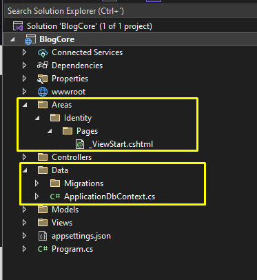

# UDY-MasterAspNetMvc-02BlogCore

## Seccion 2: Proyecto 1: Crud con Entity Framework Core

### Video 31 Creacion del proyecto

Ahora aparece una nuevas carpetas llamadas Areas y Data

Esto practicamente ya me configura todo, el appSettings

El Program tambien me lo configura

Tambien ya me configura las Dependencias

### Video 32 Creacion de las libreria de clases

Vamos a utilizar la arquitectura por capas.

### Video 33 Instalacion de Extensiones necesarias

### Video 34 Organizacion del Proyecto en Areas

### Video 35 Organizacion del Proyecto por niveles

### Video 36 Configuracion de Bootstrap y Bootswatch

### Video 37 Instalacion de Plugins Frontend

### Video 38 Conexion SQL, Contexto, Migraciones y Base de Datos

### Video 39 Creacion Modelo Categoria, Migracion y Base de Datos
