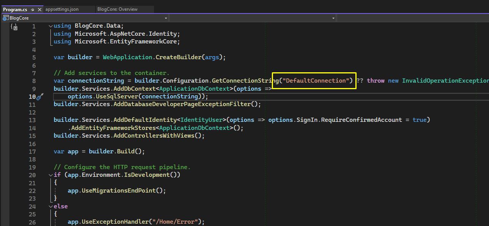

# UDY-MasterAspNetMvc-02BlogCore

## Seccion 2: Proyecto 1: Crud con Entity Framework Core

### Video 31 Creacion del proyecto

Ahora aparece una nuevas carpetas llamadas Areas y Data

Esto practicamente ya me configura todo, el appSettings

El Program tambien me lo configura

Tambien ya me configura las Dependencias

### Video 32 Creacion de las libreria de clases

Vamos a utilizar la arquitectura por capas.

### Video 33 Instalacion de Extensiones necesarias

### Video 34 Organizacion del Proyecto en Areas

* **Creo dos areas de MVC llamados Admin y Cliente**

**Hacemos cambios escructurales**

* Muevo mi HomeController y mi vista al area cliente
* Complemento en los ViewImports
* Modifico el Programa para que apunte al controlador correcto
* En el ControladorHome indico a que area pertenece

### Video 35 Organizacion del Proyecto por niveles

* **Movemos el modelo a su correspondiente capa**
* **La carpeta Data la movemos a su correspondiente capa**
* **La carpeta Migration lo dejo al mismo nivel jerarquico que Data**
* Agrego una referencia al Proyecto de BlogCore para que tenga acceso a la capa "AccesoDatos"
* Agrego una referencia al Proyecto de Acceso a datos para que tenga dependencia con

  * Models
  * Utilidades
* Creamos la carpeta ViewModes en el proyecto de Models

  

### Video 36 Configuracion de Bootstrap y Bootswatch

### Video 37 Instalacion de Plugins Frontend

### Video 38 Conexion SQL, Contexto, Migraciones y Base de Datos

### Video 39 Creacion Modelo Categoria, Migracion y Base de Datos
