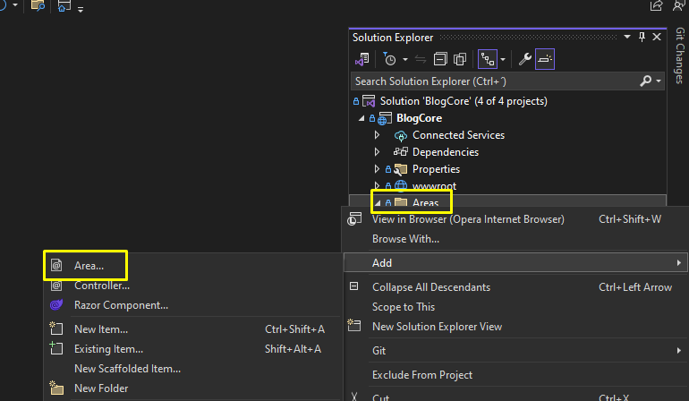
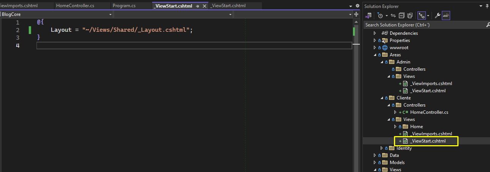

# UDY-MasterAspNetMvc-02BlogCore

## Seccion 2: Proyecto 1: Crud con Entity Framework Core

### Video 31 Creacion del proyecto


Ahora aparece una nuevas carpetas llamadas Areas y Data


Esto practicamente ya me configura todo, el appSettings


El Program tambien me lo configura


Tambien ya me configura las Dependencias


### Video 32 Creacion de las libreria de clases

Vamos a utilizar la arquitectura por capas.


### Video 33 Instalacion de Extensiones necesarias


### Video 34 Organizacion del Proyecto en Areas

* **Creo dos areas de MVC llamados Admin y Cliente**




**Hacemos cambios escructurales**

* Muevo mi HomeController y mi vista al area cliente
* Complemento en los ViewImports
* Modifico el Programa para que apunte al controlador correcto
* En el ControladorHome indico a que area pertenece





### Video 35 Organizacion del Proyecto por niveles

* **Movemos el modelo a su correspondiente capa**
* **La carpeta Data la movemos a su correspondiente capa**
* **La carpeta Migration lo dejo al mismo nivel jerarquico que Data**
* Agrego una referencia al Proyecto de BlogCore para que tenga acceso a la capa "AccesoDatos"
* Agrego una referencia al Proyecto de Acceso a datos para que tenga dependencia con

  * Models
  * Utilidades
* Creamos la carpeta ViewModes en el proyecto de Models

  

### Video 36 Configuracion de Bootstrap y Bootswatch

Bootswatch es como la siguiente Fase de Bootstrap, ya que te ofrece todo lo de bootstrap y ademas te

ofrece templates con sus respectivos colores y efectos(Atomos, Moleculas, Organismos)

* Descargo la version minimizada
* Creo un archivo de CSS dentro del directorio "wwwroot/lib/Bootstrap/dis/css/bootstrap5.min.css"
  * Dentro pego el contenido de lo que descargamos
* Vamos a la pagina maestra "_layout.cshtml"
  * **Remuevo** la etiqueta link de "~/lib/bootstrap/dist/css/**bootstrap.min.css**"
  * **Agrego** la etiqueta para el nuevo link de "~/lib/bootstrap/dist/css/**bootstrap5.min.css**"


**Recomendacion de nombre de controladores, EN PLURAL**

* Elimino el nav que estaba en la pagina maestra
* Agrego el nuevo Nav


### Video 37 Instalacion de Plugins Frontend

* En la seccion anterior podemos crear tablas basicas, pero si queremos crear tablas mas avanzadas podemos utiliza el Plugin llamado **"DataTables"**
* **sDataTables [CSS, JS]**
* **JQuery [CSS, JS]**
* **Toastr [CSS, JS]** muestra ventanitas
* **sweetalert2[CSS, JS]** para mandar alertas
* **fontawesome.com/icons[CSS]**
* **cdnjs para encontrar las librerias**

  Los CSS se importan al inicio de la pantalla

  Los JS se importan al final de la pagina.


### Video 38 Conexion SQL, Contexto, Migraciones y Base de Datos

Renderizo una vista parcial con la etiqueta en el _Layout.

``<partial name="_LoginPartial" />``

Configuramos nuestra cadena de conexion


Ejecutamos el comando en el Command Nugget

``Update-Database``

### Video 39 Creacion Modelo Categoria, Migracion y Base de Datos

Se crear el Modelo Categoria

## **Seccion 4: BlogCore - RepositoryPattern**

### Video 40 Fundamentos de RepositoryPattern


### Video 41 Introduccion RepositoryPattern


### Video 42 Unidad contenedora o unidad de trabajo

https://learn.microsoft.com/es-es/aspnet/mvc/overview/older-versions/getting-started-with-ef-5-using-mvc-4/implementing-the-repository-and-unit-of-work-patterns-in-an-asp-net-mvc-application


### Video 43 Como es el Flujo de Trabajo con el RepositoryPattern


### Video 44 Implementando Repository Parte 1

* Agregamos la carpeta Repository dentro de la capa AccesoDatos/Data
  * Creamos la carpeta IRepository
    * Creamos el interfaz IRepository Generico con su contenido
  * Creamos la clase Repository Generico con su contenido


### Video 45 Implementando Repository Parte 2

```}}
public IEnumerable<T> GetAll(Expression<Func<T, bool>>? filter = null, Func<IQueryable<T>, IOrderedQueryable<T>>? orderBy = null, string? includeProperties = null)
{
    //                                              //Se crea una consulta IQueryable a partir del DBSet del 
    //                                              //    contexto.
    IQueryable<T> query = dbSet;

    if (
        //                                          //Existe el filtro.
        filter != null
        )
    {
        query = query.Where(filter);
    }

    //                                              //Se incluyen propiedades de navegacion si se proporciona.
    if (
        includeProperties != null
        )
    {
        //                                          //Take each includeProperty
        foreach (var includeProperty in 
            includeProperties.Split(new char[] {','}, StringSplitOptions.RemoveEmptyEntries))
        {
            query = query.Include(includeProperty);
        }
    }

    //                                              //Se aplica el ordenamiento si se proporciona.
    if (
        orderBy != null
        )
    {
        //                                          //Se ejecuta la funcion y se convierte la consulta
        //                                          //    en una lista.
        return orderBy(query).ToList();
    }

    return query.ToList();
}

public T GetFirstOfDefault(Expression<Func<T, bool>>? filter = null, string? includeProperties = null)
{
    //                                              //Se crea una consulta IQueryable a partir del DBSet del 
    //                                              //    contexto.
    IQueryable<T> query = dbSet;

    if (
        //                                          //Existe el filtro.
        filter != null
        )
    {
        query = query.Where(filter);
    }

    //                                              //Se incluyen propiedades de navegacion si se proporciona.
    if (
        includeProperties != null
        )
    {
        //                                          //Take each includeProperty
        foreach (var includeProperty in
            includeProperties.Split(new char[] { ',' }, StringSplitOptions.RemoveEmptyEntries))
        {
            query = query.Include(includeProperty);
        }
    }

    return query.FirstOrDefault();
}

public void Remove(int id)
{
    T entityToRemove = dbSet.Find(id);
}

public void Remove(T entity)
{
    dbSet.Remove(entity);
}

```

### Video 46 Repositorio Categoria

* Se agrego la Interfaz ICategoria
* Se agrego la clase Categoria


### Video 47.0 Ejercicio de codificacion 2: Implementacion Patron de Repositorio (RepositoryPattern)

### Video 47.1 Implementando Unidad de Trabajo (Unit Of Work)

### Video 48

### Video 49

### Video 50

### Video 51

### Video 52

### Video 53

### Video 54

### Video 55

### Video 56

### Video 57
